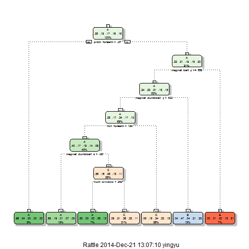

Practical Machine Learning Project (2014.12.20)
===
  
The goal of the project is to predict "classe" variable in the training set, create a report describing how to built a model and uuse cross validation, check sample error. The prediction model is going to predict 20 different test cases.  

---  
1. **Setup library and environment**  
    
    ```r
    library(caret)
    library(rattle)
    Sys.setenv("LANGUAGE"="En")
    Sys.setlocale("LC_ALL", "English")
    ```
  
2. **Import data from:**  
    [https://d396qusza40orc.cloudfront.net/predmachlearn/pml-training.csv](https://d396qusza40orc.cloudfront.net/predmachlearn/pml-training.csv)  
    [https://d396qusza40orc.cloudfront.net/predmachlearn/pml-testing.csv](https://d396qusza40orc.cloudfront.net/predmachlearn/pml-testing.csv)
    
    ```r
    if (!file.exists("pml-training.csv")) {
        download.file(url="https://d396qusza40orc.cloudfront.net/predmachlearn/pml-training.csv", destfile="pml-training.csv")
    }
    if (!file.exists("pml-testing.csv")) {
        download.file(url="https://d396qusza40orc.cloudfront.net/predmachlearn/pml-testing.csv", destfile="pml-testing.csv")
    }
    pml_training <- read.csv("pml-training.csv")
    pml_testing <- read.csv("pml-testing.csv")
    ```
  
3. **Remove unnecessary columns and highly correlated columns**  
    - Filtering pml_training
        
        ```r
            ## remove index (1), username (2), timestamp (3,4,5), new_window (6)
            df <- pml_training[, -c(1,2,3,4,5,6)]
        
            ## remove columns with NAs and empty-components greater than 1/10 of row number
            i <- 1:ncol(df)
            v <- sapply(i, function(x){
                (length(which(is.na(df[,x]))) > nrow(df)/10) || (sum(df[,x]=="") > nrow(df)/10)
            })
            df <- df[, !v]
        
            ## set classe as factor
            df$classe <- as.factor(df$classe)
        
            ## remove high correlated columns
            c_i <- which(names(df)=="classe")
            M <- abs(cor(df[,-c_i]))
            h_c_i <- findCorrelation(M, 0.9)
            df <- df[,-h_c_i]
        ```
    - Define training samples and testing samples for modeling with simple cross-validation
        
        ```r
            set.seed(20141221)
            index_cross_training <- createDataPartition(df$classe, p=0.8, list=F)
            cv_training <- df[index_cross_training,]
            cv_testing <- df[-index_cross_training,]
        ```
    - Filtering pml_testing
        
        ```r
            testing <- pml_testing[,-c(1,2,3,4,5,6)]
            i <- 1:ncol(testing)
            v <- sapply(i, function(x){
                (length(which(is.na(testing[,x]))) > nrow(testing)/10) || (sum(testing[,x]=="") > nrow(testing)/10)
            })
            testing <- testing[,!v] 
        ```
4. **Use Recursive Partitioning and Regression Trees (rpart) model**
    - Build training model
        
        ```r
        set.seed(20141221)
        modFit1 <- train(classe~., method="rpart", data=cv_training)
        ```
    - Classification tree and accuracy  
        
        ```r
            fancyRpartPlot(modFit1$finalModel)
        ```
        
         
        
        ```r
            ## accurcty of the model
            model_1_accuracy <- max(modFit1$results$Accuracy)
        ```
    The accuracy of the model is 55.94 %  
    - Cross Validation
        
        ```r
            model_1_prediction <- predict(modFit1, cv_testing)
            cv_1 <- confusionMatrix(model_1_prediction, cv_testing$classe)
            cv_1
        ```
        
        ```
        ## Confusion Matrix and Statistics
        ## 
        ##           Reference
        ## Prediction   A   B   C   D   E
        ##          A 924 147  18  65  68
        ##          B  20 212  21 115 121
        ##          C 171 393 642 403 270
        ##          D   0   0   0   0   0
        ##          E   1   7   3  60 262
        ## 
        ## Overall Statistics
        ##                                         
        ##                Accuracy : 0.52          
        ##                  95% CI : (0.504, 0.536)
        ##     No Information Rate : 0.284         
        ##     P-Value [Acc > NIR] : <2e-16        
        ##                                         
        ##                   Kappa : 0.391         
        ##  Mcnemar's Test P-Value : <2e-16        
        ## 
        ## Statistics by Class:
        ## 
        ##                      Class: A Class: B Class: C Class: D Class: E
        ## Sensitivity             0.828    0.279    0.939    0.000   0.3634
        ## Specificity             0.894    0.912    0.618    1.000   0.9778
        ## Pos Pred Value          0.756    0.434    0.342      NaN   0.7868
        ## Neg Pred Value          0.929    0.841    0.979    0.836   0.8721
        ## Prevalence              0.284    0.193    0.174    0.164   0.1838
        ## Detection Rate          0.236    0.054    0.164    0.000   0.0668
        ## Detection Prevalence    0.311    0.125    0.479    0.000   0.0849
        ## Balanced Accuracy       0.861    0.596    0.778    0.500   0.6706
        ```
        
        ```r
            cv_1_accuracy <- cv_1$overall["Accuracy"]
        ```
    The cross-validation has accuracy 52.00 %  
    The performance of **Recursive Partitioning and Regression Trees** (`rpart`) model is poor. 
5. **Use Random Forest (rf) model**  
    - Build training model
        
        ```r
            set.seed(20141221)
            tc <- trainControl(method="cv") ## using cross validation
            modFit2 <- train(classe~., method="rf", data=cv_training,
                        ntree=200, trControl=tc, allowParallel=T)
        ```
    - Model accuracy
        
        ```r
            ## accurcty of the model
            model_2_accuracy <- max(modFit2$results$Accuracy)
        ```
        The accuracy of the model is 99.82 %
    - Cross Validation
        
        ```r
            model_2_prediction <- predict(modFit2, cv_testing)
            cv_2 <- confusionMatrix(model_2_prediction, cv_testing$classe)
            cv_2
        ```
        
        ```
        ## Confusion Matrix and Statistics
        ## 
        ##           Reference
        ## Prediction    A    B    C    D    E
        ##          A 1116    3    0    0    0
        ##          B    0  755    1    0    0
        ##          C    0    1  683    0    0
        ##          D    0    0    0  643    1
        ##          E    0    0    0    0  720
        ## 
        ## Overall Statistics
        ##                                         
        ##                Accuracy : 0.998         
        ##                  95% CI : (0.997, 0.999)
        ##     No Information Rate : 0.284         
        ##     P-Value [Acc > NIR] : <2e-16        
        ##                                         
        ##                   Kappa : 0.998         
        ##  Mcnemar's Test P-Value : NA            
        ## 
        ## Statistics by Class:
        ## 
        ##                      Class: A Class: B Class: C Class: D Class: E
        ## Sensitivity             1.000    0.995    0.999    1.000    0.999
        ## Specificity             0.999    1.000    1.000    1.000    1.000
        ## Pos Pred Value          0.997    0.999    0.999    0.998    1.000
        ## Neg Pred Value          1.000    0.999    1.000    1.000    1.000
        ## Prevalence              0.284    0.193    0.174    0.164    0.184
        ## Detection Rate          0.284    0.192    0.174    0.164    0.184
        ## Detection Prevalence    0.285    0.193    0.174    0.164    0.184
        ## Balanced Accuracy       0.999    0.997    0.999    1.000    0.999
        ```
        
        ```r
            cv_2_accuracy <- cv_2$overall["Accuracy"]
        ```
    The cross-validation has accuracy 99.85 %
    The performance of **Random Forest** (`rf`) model is great.  
6. **Predict classe of test data by Random Forest (rf) model**  
    
    ```r
        predict <- predict(modFit2, newdata=pml_testing)
    ```
        The predictions are:  
        B, A, B, A, A, E, D, B, A, A, B, C, B, A, E, E, A, B, B, B    
      
    
    
