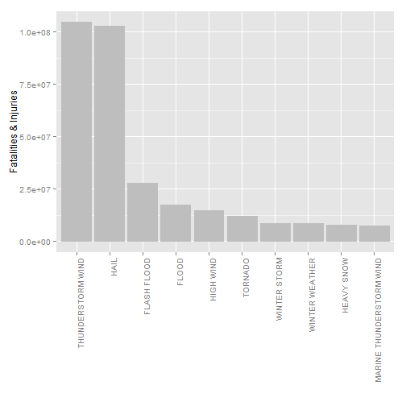
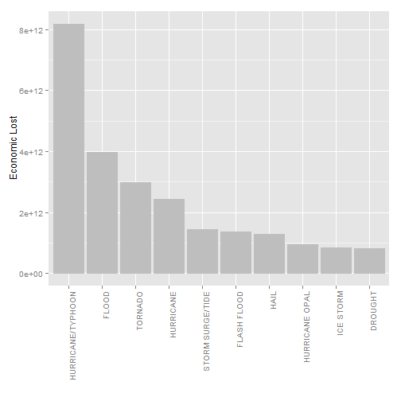

Reproducible Research Assignment #2  
====
Sunday, September 21, 2014  
----
This the assignment #2 of **Reproducible Research Assignment** for **Storm Data Analysis**.  

---

# Damange Analysis of National Weather Service Storm Data (1950-2011)

## Synopsis  
To understand the damages (public health and economic problems) for communities and municipalities in different types of natural disasters and events, we explored and ran simple analysis on storm database of the U.S. National Oceanic and Atmospheric Administration (NOAA). The database of NOAA contains records of damages in different types of events from 1950 to 2011.  
  
In our first data analysis, we filtered and then processed the valid dataset to accumulate the number of fatalities and injuries by different types of events. So, we can understand how these events impact health of people. The second analysis about the economic lost. We accumulate the damage cost (product s and crops) by different types of events.  
The results show hail, thunderstorm and flood are ranked the top natural disasters of health of the citizens. The hurricane, storm and flood are the top threats of economic lost.  
  
**CAVEAT:**
Many records in the database can be either lost or incorrect (human typing error), the valid data are less than 10% of the original data. The analyzed results might not reflect the reality.
    
  
## Data Processing

```r
## load library and declare trim function
library(xtable)
library(ggplot2)
library(R.utils)
```

```
## Loading required package: R.oo
## Loading required package: R.methodsS3
## R.methodsS3 v1.6.1 (2014-01-04) successfully loaded. See ?R.methodsS3 for help.
## R.oo v1.18.0 (2014-02-22) successfully loaded. See ?R.oo for help.
## 
## Attaching package: 'R.oo'
## 
## The following objects are masked from 'package:methods':
## 
##     getClasses, getMethods
## 
## The following objects are masked from 'package:base':
## 
##     attach, detach, gc, load, save
## 
## R.utils v1.33.0 (2014-08-24) successfully loaded. See ?R.utils for help.
## 
## Attaching package: 'R.utils'
## 
## The following object is masked from 'package:utils':
## 
##     timestamp
## 
## The following objects are masked from 'package:base':
## 
##     cat, commandArgs, getOption, inherits, isOpen, parse, warnings
```

```r
trim <- function (x) gsub("^\\s+|\\s+$", "", x)
```
1. **Load the data:**
    - Download storm data ([repdata_data_StormData.csv.bz2](https://d396qusza40orc.cloudfront.net/repdata%2Fdata%2FStormData.csv.bz2)     ), extract repdata_data_StormData.csv from repdata_data_StormData.csv.bz2 and read dataset.  
        
        ```r
        library(knitr)
        ##opts_chunk$set(cache=TRUE)
        source_url="https://d396qusza40orc.cloudfront.net/repdata%2Fdata%2FStormData.csv.bz2"
        source_file="repdata_data_StormData.csv.bz2"
        data_file="repdata_data_StormData.csv"
        ## download file and extract file
        if (!file.exists(source_file)) {
            ## download repdata_data_StormData.csv.bz2
            download.file(source_url, source_file, method="curl", quiet=T)        
        }
        if (!file.exists(data_file)){
            ## extract bz2 file
            bunzip2(source_file,data_file)
        }
        
        ## read csv data
        data<-read.csv(data_file, sep=",", header=T, quote ="")
        ```
    
    - Remove unused rows, empty events, keep (EVTYPE,FATALITIES,INJURIES,PROPDMG,PROPDMGEXP,CROPDMG,CROPDMGEXP) and trim character rows
        
        ```r
        ## remove unused rows
        wdata <- data[,c(8,23:28)]
        ## trim and set to upper case
        wdata$EVTYPE=toupper(trim(wdata$EVTYPE))
        wdata$PROPDMGEXP=toupper(trim(wdata$PROPDMGEXP))
        wdata$CROPDMGEXP=toupper(trim(wdata$CROPDMGEXP))
        
        ## remove NA in EVTYPE
        wdata <- subset(wdata,!(wdata$EVTYPE=="" | wdata$EVTYPE=="?"))
        
        ## transform factor columns to numeric columns
        wdata$FATALITIES <- as.numeric(wdata$FATALITIES)
        wdata$INJURIES <- as.numeric(wdata$INJURIES)
        wdata$PROPDMG <- as.numeric(wdata$PROPDMG)
        wdata$CROPDMG <- as.numeric(wdata$CROPDMG)
        
        
        ## remove rows of no damages
        wdata <- subset(wdata,!(wdata$FATALITIES==0 
                      & wdata$INJURIES==0
                      & wdata$PROPDMG==0
                      & wdata$CROPDMG==0))
        ```
          
    - Fix values in PROPDMGEXP and CROPDMGEXP
        
        ```r
        ## values of PROPDMGEXP & CROPDMGEXP
        ## 0 = 1
        ## H = 100
        ## K = 1000
        ## M = 1000000
        ## B = 1000000000
        ## Others = (unknown or typo, ignore these rows)
        
        wdata <- subset(wdata, wdata$PROPDMGEXP %in% c("0","H","K","M","B"))
        wdata <- subset(wdata, wdata$CROPDMGEXP %in% c("0","H","K","M","B"))
        ```
      
2. **Process and calculate impact of population health**
    - Add new column for total impacted persons
    - Calculate total impacted persons
    - Aggregate impacted persons by EVTYPE
        
        ```r
        ## add new column TOTAL_PEOPLE to calculate sum op FATALITIES INJURIES
        wdata$TOTAL_PEOPLE = wdata$FATALITIES+wdata$INJURIES
            
        ## aggregate sum of TOTAL_PEOPLE by different EVTYPE
        people_data <- aggregate(TOTAL_PEOPLE~EVTYPE, data=wdata, FUN=sum)
        people_data <- people_data[order(people_data$TOTAL_PEOPLE,decreasing=T),]       
        ```
    
3. **Process and calculate damage of products and crops**
    - Add new columns for total damage cost
    - Calculate total damage cost
    - Aggregate total damage cost by EVTYPE
        
        ```r
        ## add new columns PROD_LOST, CROP_LOST, TOTAL_LOST
        ## calculate total damange of product and crop
        wdata$PROD_LOST=wdata$PROPDMG*sapply(wdata$PROPDMGEXP, function(x) {
            if (x=="0") {1} 
            else if (x=="H") {100}
            else if (x=="K") {1000}
            else if (x=="M") {1000000}
            else if (x=="B") {1000000000}
        })
        wdata$CROP_LOST=wdata$CROPDMG*sapply(wdata$CROPDMGEXP, function(x) {
            if (x=="0") {1} 
            else if (x=="H") {100}
            else if (x=="K") {1000}
            else if (x=="M") {1000000}
            else if (x=="B") {1000000000}
        })
        wdata$TOTAL_LOST=wdata$PROD_LOST+wdata$CROP_LOST
        
        ## aggregate sum of TOTAL_LOST by different EVTYPE
        cost_data <- aggregate(TOTAL_LOST~EVTYPE, data=wdata, FUN=sum)
        cost_data <- cost_data[order(cost_data$TOTAL_LOST,decreasing=T),]
        ```

##Results
1. **Which types of events are most harmful with respect to population health?**
    - The top types of events and impacted population
    
    ```r
    names(people_data) <- c("Event", "Population")
    xt <- xtable(head(people_data[,1:2],10))
    ```
    <!-- html table generated in R 3.1.1 by xtable 1.7-3 package -->
    <!-- Sun Sep 21 22:29:04 2014 -->
    <TABLE border=1>
    <TR> <TH> Event </TH> <TH> Population </TH>  </TR>
      <TR> <TD> THUNDERSTORM WIND </TD> <TD align="right"> 104577212.00 </TD> </TR>
      <TR> <TD> HAIL </TD> <TD align="right"> 102678960.00 </TD> </TR>
      <TR> <TD> FLASH FLOOD </TD> <TD align="right"> 27772011.00 </TD> </TR>
      <TR> <TD> FLOOD </TD> <TD align="right"> 17395616.00 </TD> </TR>
      <TR> <TD> HIGH WIND </TD> <TD align="right"> 14764116.00 </TD> </TR>
      <TR> <TD> TORNADO </TD> <TD align="right"> 12155447.00 </TD> </TR>
      <TR> <TD> WINTER STORM </TD> <TD align="right"> 8623869.00 </TD> </TR>
      <TR> <TD> WINTER WEATHER </TD> <TD align="right"> 8554175.00 </TD> </TR>
      <TR> <TD> HEAVY SNOW </TD> <TD align="right"> 7723498.00 </TD> </TR>
      <TR> <TD> MARINE THUNDERSTORM WIND </TD> <TD align="right"> 7463292.00 </TD> </TR>
       </TABLE>
      
    &nbsp;
    - Diagram of fatalities and injuries of different types of events
    
    ```r
    hplot <- ggplot(data=people_data[1:10,], 
                    aes(x=reorder(Event,-Population), y=Population)) + 
        geom_bar(stat="identity", colour="grey", fill="grey",
                 position=position_dodge()) +
        theme(axis.text.x=element_text(angle=90,hjust=1)) +
        xlab("") + ylab("Fatalities & Injuries")
    print(hplot)
    ```
    
     
            
2. **Which types of events have the greatest economic consequences?**
    - The top types of events and economic lost
    
    ```r
    names(cost_data) <- c("Event", "Lost")
    xt <- xtable(head(cost_data[,1:2],10))
    ```
    <!-- html table generated in R 3.1.1 by xtable 1.7-3 package -->
    <!-- Sun Sep 21 22:29:05 2014 -->
    <TABLE border=1>
    <TR> <TH> Event </TH> <TH> Lost </TH>  </TR>
      <TR> <TD> HURRICANE/TYPHOON </TD> <TD align="right"> 8189779133000.00 </TD> </TR>
      <TR> <TD> FLOOD </TD> <TD align="right"> 3971670213000.00 </TD> </TR>
      <TR> <TD> TORNADO </TD> <TD align="right"> 2990824695059.00 </TD> </TR>
      <TR> <TD> HURRICANE </TD> <TD align="right"> 2439859255000.00 </TD> </TR>
      <TR> <TD> STORM SURGE/TIDE </TD> <TD align="right"> 1449729680000.00 </TD> </TR>
      <TR> <TD> FLASH FLOOD </TD> <TD align="right"> 1356521078588.00 </TD> </TR>
      <TR> <TD> HAIL </TD> <TD align="right"> 1300279192384.00 </TD> </TR>
      <TR> <TD> HURRICANE OPAL </TD> <TD align="right"> 946497000000.00 </TD> </TR>
      <TR> <TD> ICE STORM </TD> <TD align="right"> 845990155629.00 </TD> </TR>
      <TR> <TD> DROUGHT </TD> <TD align="right"> 820019605000.00 </TD> </TR>
       </TABLE>
      
    &nbsp;
    - Diagram of economic lost of different types of events
    
    ```r
    hplot <- ggplot(data=cost_data[1:10,], 
                    aes(x=reorder(Event,-Lost), y=Lost)) + 
        geom_bar(stat="identity", colour="grey", fill="grey",
                 position=position_dodge()) +
        theme(axis.text.x=element_text(angle=90,hjust=1)) +
        xlab("") + ylab("Economic Lost")
    print(hplot)
    ```
    
     
